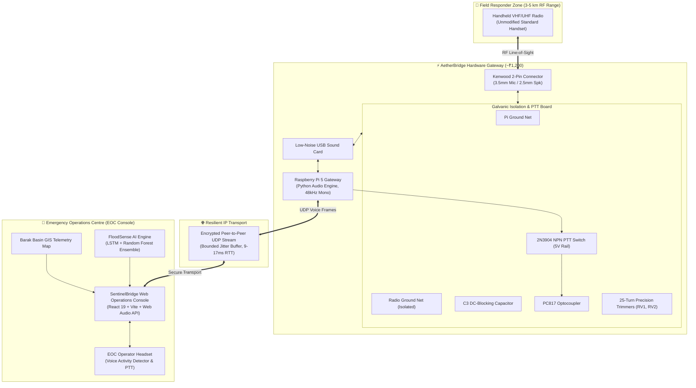

# 🛡️ SentinelBridge — Emergency Operations Console & Radio-over-IP Voice Gateway

<div align="center">

[](https://smartindiahackathon.gov.in/)
[](https://smartindiahackathon.gov.in/)
[](https://smartindiahackathon.gov.in/)
[](http://www.nits.ac.in/)
[](LICENSE)

**Team Aether_100 (Team ID: `NITS_100`) · National Institute of Technology Silchar**  
*Mentor: Dr. Koushik Guha · September 2026*

[📐 CAD & 3D Hardware Model (Google Drive)](https://drive.google.com/file/d/1Ka_F5BRAXkGf56-jew4U-lu_tEWLgjRq/view) • [📄 Technical Documentation PDF](./AetherBridge%20—%20Technical%20Documentation%20(Aether_100,%20SIH%202026).pdf) • [⚡ Live EOC Operations Console](#-live-eoc-operations-console--ui) • [🛠️ Hardware Circuit](#-hardware-circuit--electrical-design)

---
</div>

## 📌 Executive Summary

During major flood disasters (such as the devastating Barak Valley / Silchar floods), commercial cellular base stations and 5G infrastructure are routinely submerged, overloaded, or knocked offline. First responders in the field rely on standard handheld VHF/UHF walkie-talkies having an RF line-of-sight range of only **3 to 5 km**, while district **Emergency Operations Centres (EOCs)** are situated tens of kilometres away.

Commercial Radio-over-IP (RoIP) appliances are expensive proprietary imports costing ₹2,00,000–₹5,00,000+ per unit and require complete handset replacements.

**SentinelBridge** bridges this critical gap through a unified disaster management platform combining:
1. **AetherBridge (Voice Subsystem)**: A low-cost (**~₹1,200** BOM), plug-and-play Radio-over-IP gateway that connects standard field walkie-talkies to surviving IP links (satellite, mesh, wireline) without modifying field radios or acquiring new RF spectrum.
2. **FloodSense (Predictive AI Subsystem)**: A real-time hydrological forecasting engine and geospatial EOC console utilizing an ensemble of **Bidirectional LSTM** and **Random Forest** models to predict river stage levels and hydrographs hours before peak inundation occurs.

---

## 🔗 Quick Resource Links

| Resource | Description | Direct Link |
| :--- | :--- | :--- |
| 📐 **CAD 3D Enclosure & Enclosure Design** | Complete 3D CAD assembly, STEP/DWG files & mounting chassis for Raspberry Pi + audio interface board | [**Google Drive CAD Link**](https://drive.google.com/file/d/1Ka_F5BRAXkGf56-jew4U-lu_tEWLgjRq/view) |
| 📄 **Hardware Technical Documentation** | Full 7-page engineering documentation covering circuit schematics, ground-loop math, optocoupler saturation, and RF bench test results | [**View PDF in Repository**](./AetherBridge%20—%20Technical%20Documentation%20(Aether_100,%20SIH%202026).pdf) |
| 🧠 **ML Model Training Pipeline** | Synthetic & historical hydrograph training script with LSTM and Random Forest export | [`scripts/train_flood_models.py`](./scripts/train_flood_models.py) |
| 💻 **EOC Operations Web Console** | React 19 + TypeScript + Vite + Tailwind CSS interactive tactical console with oscilloscope, live map, and risk engine | [`src/`](./src/) |

---

## 🏛️ System Architecture



---

## 📻 Subsystem 1: AetherBridge Voice Gateway

### 1. The "No New Transmitter" Design Principle
AetherBridge does not contain an RF transmitter. It acts as an intelligent intermediary:
- Audio is tapped directly from the radio's auxiliary/accessory port.
- Push-to-Talk (PTT) is keyed mechanically/electrically using an optocoupler switch.
- Every RF emission originates exclusively from the agency's existing licensed VHF/UHF base station or handheld. No separate wireless spectrum allotment (WPC) is needed.

### 2. The Kenwood 2-Pin Ground-Loop Problem & Resolution
A standard Kenwood two-pin connector combines a 3.5 mm (mic/PTT) and 2.5 mm (speaker) plug. Most off-the-shelf schematics fail because:
- The **2.5 mm sleeve** is the Radio Ground.
- The **3.5 mm sleeve** is the Microphone Return AND PTT sense line.
- When connected to a standard USB sound card with a shared internal ground, the two sleeves are joined, immediately causing a **stuck carrier** that overheats the radio's power amplifier.

**Solution: Strict Two-Ground Net Architecture**
- **Pi Ground Net**: Pi GND, USB sound card sleeves, trimmers RV1/RV2, optocoupler collector.
- **Radio Ground Net**: Radio 2.5 mm sleeve, optocoupler emitter.
- **Isolation**: Nets meet *only* across DC-blocking capacitor $C_3$ (passes AC audio while blocking DC) and the optical gap of the optocoupler. When powered down, resistance between brown and green lines measures **infinite / open circuit**.

```
  [2.5mm Tip] ----( C1 1uF )----+----[ RV1 10k ]----> USB MIC IN (Tip)
                                |
  [2.5mm Sleeve] --( Radio GND )+--( C3 1uF )--------> Pi GND (Sleeve)
  
  [3.5mm Ring] <---( C2 1uF )---+----[ RV2 10k ]<----[ R1 100k ]<--- USB HP OUT
  
  [3.5mm Sleeve] <--( Opto Collector ) 
  [2.5mm Sleeve] <--( Opto Emitter   ) <=== (Driven by 2N3904 from Pi GPIO17)
```

### 3. Audio Chain & PTT Interlock Timers
- **Software Squelch**: Rolling RMS algorithm calculated on 10 ms frames (480 samples @ 48 kHz).
- **PTT Lead-in Time**: Gateway waits **250 ms** after keying PTT before feeding audio, allowing the transmitter power amplifier to stabilize and the remote receiver's squelch gate to open.
- **PTT Tail Time**: PTT is maintained for **350 ms** after speech ends.
- **Fail-Safe Watchdog**: Hard **30-second timeout** automatically releases PTT to prevent stuck transmissions.
- **Half-Duplex Interlock**: Discards microphone input during local transmission to prevent acoustic/electrical oscillation feedback loops.

---

## 🌊 Subsystem 2: FloodSense Predictive AI Engine

FloodSense transforms raw hydro-meteorological sensor streams into actionable disaster mitigation intelligence.

### 1. Machine Learning Hydrological Ensemble
- **Bi-Directional LSTM (Long Short-Term Memory)**: Captures complex temporal dependencies, antecedent soil moisture retention, and cumulative 6-hour/24-hour precipitation lags.
- **Random Forest Regressor**: Estimates non-linear peak river stage thresholds based on basin geometry, upstream telemetry, and sudden cloudburst spikes.
- **Physics-Informed Ensemble**: Blends ML inference with hydrograph mass-conservation bounds to generate **95% Confidence Intervals (CI)**.

```
┌─────────────────────────┐     ┌────────────────────────┐
│ 6h / 24h Rainfall Rates │     │ Antecedent River Stage │
└────────────┬────────────┘     └───────────┬────────────┘
             │                              │
             ▼                              ▼
      ┌──────────────┐              ┌──────────────┐
      │  LSTM Neural │              │ Random Forest│
      │   Network    │              │  Regressor   │
      └──────┬───────┘              └──────┬───────┘
             │                             │
             └──────────────┬──────────────┘
                            ▼
               ┌─────────────────────────┐
               │    Ensemble Blending    │
               │ (Confidence & CI Margin)│
               └────────────┬────────────┘
                            ▼
   ┌─────────────────────────────────────────────────┐
   │ Hydrograph Forecast + CWC 4-Tier Risk Escalation│
   │   [SAFE]  -->  [WATCH]  -->  [WARN]  -->  [CRIT]│
   └─────────────────────────────────────────────────┘
```

### 2. CWC 4-Tier Early Warning Standard
| Alert Tier | River Stage Range | Visual Indicator | Acoustic Telemetry Sound |
| :--- | :--- | :--- | :--- |
| **SAFE** | $< 13.0\text{ m}$ | Emerald Ambient Glow | Standby Chirp (Periodic) |
| **WATCH** | $13.0\text{ m} - 16.0\text{ m}$ | Amber Glow | Single Advisory Ping |
| **WARNING** | $16.0\text{ m} - 19.5\text{ m}$ | High-Intensity Orange Glow | Dual Warning Tone Pulse |
| **CRITICAL** | $\ge 19.5\text{ m}$ (Danger $>19.8\text{ m}$) | Flashing Crimson Strobe | Rapid Evacuation Siren (Continuous with manual silence) |

---

## 📊 Verification & Bench Test Results

As verified during rigorous hardware and RF bench trials (detailed in the [Technical Documentation](./AetherBridge%20—%20Technical%20Documentation%20(Aether_100,%20SIH%202026).pdf)):

| Stage | Verification Test | Expected Standard | Measured / Observed Result | Status |
| :---: | :--- | :--- | :--- | :---: |
| **1** | Optocoupler In/Out Ground Isolation | $\infty\ \Omega$ (Open Circuit) | Open Circuit | ✅ **PASS** |
| **2** | Unpowered Board Isolation (Brown to Green) | $\infty\ \Omega$ (Open Circuit) | Open Circuit | ✅ **PASS** |
| **3** | Radio Idle with Gateway Powered (60s) | No RF Carrier Keyed | $0.00\text{ V}$ PTT Trigger / No Transmission | ✅ **PASS** |
| **4** | Software PTT Keying (GPIO17 High) | Reliable TX Closure | **$0.15\text{ V}$** saturation across switch | ✅ **PASS** |
| **5** | Transmit Audio Frequency Response | Clean 1 kHz Modulation | Received clear tone on monitor radio | ✅ **PASS** |
| **6** | Network Round-Trip Time (RTT) | $< 50\text{ ms}$ over WAN | **$9 - 17\text{ ms}$** UDP frame latency | ✅ **PASS** |
| **7** | Network Disconnect Resilience | Graceful Degradation | Radios operate locally; RoIP resumes in $<1\text{s}$ | ✅ **PASS** |

---

## 🗂️ Repository Structure

```tree
SIH_2026/
├── AetherBridge — Technical Documentation.pdf  # Comprehensive 7-page engineering report
├── index.html                                 # HTML5 entry point with viewport config
├── package.json                               # Dependencies (React 19, Vite, Leaflet, Tailwind)
├── tailwind.config.js                         # Design system styling configuration
├── vite.config.ts                             # Vite configuration
│
├── scripts/
│   └── train_flood_models.py                  # Python AI pipeline for flood hydrograph ML
│
└── src/
    ├── App.tsx                                # Main application root & perimeter glow orchestrator
    ├── index.css                              # Tailwind CSS v4 & custom animations
    │
    ├── components/
    │   ├── Header.tsx                         # EOC status bar, risk badge, theme & sound controls
    │   ├── SubsystemsTopBar.tsx               # Quick subsystem switcher & metrics header
    │   ├── SidebarLeft.tsx                    # Telemetry event feed, storm scenario triggers, PTT
    │   ├── SidebarRight.tsx                   # Live station gauges, upstream sensors, logs
    │   ├── BottomStatusBar.tsx                # Gateway link health, latency & system stats
    │   │
    │   ├── AetherBridge/                      # --- RoIP Voice Gateway Components ---
    │   │   ├── AetherBridgePanel.tsx          # Main AetherBridge dashboard layout
    │   │   ├── AetherControls.tsx             # PTT triggers, noise injection, 5G drop/restore
    │   │   ├── AudioOscilloscope.tsx          # Real-time Web Audio API visualizer & RMS squelch
    │   │   ├── CommunicationPipeline.tsx      # Interactive interactive signal flow diagram
    │   │   ├── LatencyBudget.tsx              # Latency breakdown (frame, jitter, PTT lead)
    │   │   ├── LinkHealth.tsx                 # Packet loss, jitter, ping, mesh fallback
    │   │   └── SpectrumChart.tsx              # RF frequency & voice spectrum display
    │   │
    │   └── FloodSense/                        # --- Predictive AI Flood Components ---
    │       ├── FloodSensePanel.tsx            # Main FloodSense dashboard layout
    │       ├── BasinMap.tsx                   # Leaflet interactive GIS basin & station map
    │       ├── FloodChart.tsx                 # Hydrograph charts, predicted peak, 95% CI bands
    │       ├── FloodControls.tsx              # Rainfall/stage sliders & historical scenarios
    │       ├── ModelCards.tsx                 # LSTM vs Random Forest architecture & metrics
    │       └── RiskLadder.tsx                 # CWC 4-stage emergency escalation ladder
    │
    ├── hooks/
    │   └── useSimulationState.ts              # Centralized reactive state & scenario engine
    │
    ├── models/
    │   ├── floodMlEngine.ts                   # In-browser hydrological ML inference engine
    │   └── trainedDataset.json                # Pre-trained weights, baselines, and historical storms
    │
    ├── types/
    │   └── simulation.ts                      # Strict TypeScript interfaces & contracts
    │
    └── utils/
        └── audioSystem.ts                     # Web Audio API synthesizers for acoustic alarms
```

---

## 🚀 Quick Start Guide

### Prerequisites
- **Node.js**: v18.0.0 or higher
- **npm** or **yarn** or **pnpm**
- *(Optional)* **Python 3.10+** (if executing the ML retraining script)

### 1. Installation
```bash
# Clone the repository
git clone https://github.com/techy-geek/Team_Aether.git
cd Team_Aether

# Install dependencies
npm install
```

### 2. Development Server
Start the local Vite development server with Hot Module Replacement (HMR):
```bash
npm run dev
```
Open your browser and navigate to `http://localhost:5173`.

### 3. Production Build
Compile and bundle the production-ready application:
```bash
npm run build
```
Preview the production build locally:
```bash
npm run preview
```

### 4. Running the ML Training Script *(Optional)*
To retrain or benchmark the hydrological models on new rainfall datasets:
```bash
# Install Python ML prerequisites
pip install numpy scikit-learn pandas

# Execute training script
python scripts/train_flood_models.py
```

---

## 🛠️ Hardware Bill of Materials (BOM)

| Component | Part / Spec | Approximate Cost (INR) | Purpose |
| :--- | :--- | :---: | :--- |
| **Optocoupler** | PC817 / 4N35 DIP-4 | ₹15 | Galvanic isolation for PTT trigger |
| **Switching Transistor** | 2N3904 NPN | ₹5 | Pulls optocoupler LED against 5V rail |
| **Precision Trimmers** | 10 kΩ 25-Turn (RV1, RV2) | ₹80 | RX and TX impedance & gain matching |
| **Resistors** | 1 kΩ (Base), 100 kΩ (Attenuator) | ₹5 | Base drive & headphone line attenuation |
| **Capacitors** | 1.0 µF Film / Ceramic (C1, C2, C3) | ₹25 | DC blocking & AC audio passthrough |
| **Audio Interface** | C-Media CM108 USB Sound Card | ₹350 | Dedicated low-noise ADC/DAC |
| **Harness & Plugs** | 2.5 mm + 3.5 mm Kenwood Cable | ₹250 | Interfacing base VHF/UHF radio |
| **Prototyping / Enclosure**| Custom 3D Printed Chassis / PCB | ₹470 | Mechanical housing & mounting |
| **TOTAL (Interface Subsystem)** | — | **~₹1,200** | *(Excludes Raspberry Pi & Radio)* |

---

## 💡 Team & Hackathon Credits

* **Event**: Smart India Hackathon (SIH) 2026
* **Problem Statement**: `SIH26223` (Disaster Management / Hardware)
* **Team**: **Team Aether_100**
* **Team ID**: `NITS_100`
* **Institution**: National Institute of Technology Silchar (NIT Silchar)
* **Project Mentor**: Dr. Koushik Guha

---

## 📜 License & Open Source

This project is released under the **MIT License**. Open-source contribution and civic disaster deployments are encouraged.
